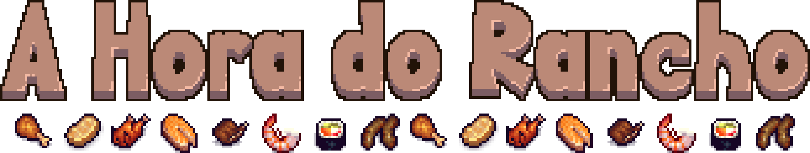

# A Hora do Rancho

This is a college midterm project in python for the subject CES-22: Object-Oriented Programming, in ITA (Instituto Tecnológico de Aeronáutica, Brazil). "A Hora do Rancho" is a game developed by three ITA students: Ariel Claudino (`arielsclaudino@gmail.com`), Emmanuel Dias (`emanusdias@gmail.com`) and Gabriel Gandour (`gagandour@gmail.com`).

## How to Execute

### By Cloning the Repo

After downloading the repository, execute the `main.py` file in the `lib` folder.

### Or Download the Executable File

Download the executable file on [https://gabriel-gandour.itch.io/a-hora-do-rancho](https://gabriel-gandour.itch.io/a-hora-do-rancho)

## The Game

"A Hora do Rancho" was inspired in the daily eating life of an ITA student. Every day we eat at the *Rancho* (a kind of a college restaurant), which serves food that, sometimes are tasty, but sometimes are not so good. In this game, the player is someone who has to have a good meal at the *Ranch*.

Each level of this game has two parts, and the player wins the game after completed all the levels. 

### Part 1 : Food Preferences Choice

In every level, the player is presented with two dishes. The player will choose one of them to be a good food and the other one will be set to be a bad food. The player has to memorize which of them he chose.

### Part 2 : Ranch Time

After choosing the good food, the player will control (using the arrow keys or `WASD`, and press `ESC` to pause) a character in a small map (the *Rancho*). The character has a health bar and a disgust bar. Many dishes will randomly spawn in the map and fly in a certain direction. To eat it, the character has to collide with the food.

The health bar starts full and decreases over time. To replenish it, the player has to eat a good food. If it goes down to zero, the character dies of hunger, and the game shows the game over screen.

The disgust bar starts empty and, if the player eats a bad food, it increases by a certain amount. It naturaly decreases slowly over time.

This part ends succesfully if the player survive until the clock on the top-right corner indicates 11:30. If this happens, the player also passes the level.

### The Catch

The dishes that may spawn in the second part of each level include every dish that has already appeared in the first part of any of the previous levels. This means that the player has to memorize every single choice made from the start menu until the current level.

The spawning rate of the food also increases slightly over the levels.

### Rancho Especial

Sometimes, a burger may appear. This is the *Rancho Especial* power-up. If the player eats this burger, only burgers will spawn for the next 5 in-game minutes (the in-game time is indicaded by the clock on the top-right corner, and one in-game minute lasts for, approximately, one second). A burger is always a good food.

### Blackout!

Sometimes, the power may go out. When this happens, visibility is reduced for a certain amount of time and the music volume will go down. Eventually, the lights will be fixed and visibility and music will go back to normal.

## Architecture

### Folder Organization

There are two main folders: `assets`, in which one can find the text fonts, music, sound effects and images used in the project, and the folder `lib`, which contains the real code.

Paralel to these folders, the course final presentation that was used in the classroom (`CES22 - 2022 PyGame Entrega Final.pdf`) was added too.

Inside `lib`, there are 5 python files and 5 other folders. The five files consist of general code or settings variables that need to be used to a great quantity of files. There is also the `main.py` file, that executes the game.

The `pages` folder contains the files that represent possible pages in the game (for instance the start menu and the game over screen).

The `player` folder contains the code that controls the character.

The `widgets` folder contains files that implement components like buttons and text.

The `objects` folder contains the files for each kind of dishes. It looks like repeated code, but the original idea was that each food had a different path in the map.

Finally, the `tests` folder should be used for debug purposes only and contains scripts that simulates specific parts of the game, so that the developers don't have to go through the whole game to test a specific feature (for example, instead of playing the whole game and win to test the "You Win" screen, it's possible to simply run the `test_you_win_page.py` script instead).

### A Summarized Code Structure

The `main.py` file contains a Game class, which is responsible for orchestrating all the pages and states of the game. It communicates directly with the page classes in the folder `pages`. The pages `you_win_page.py`, `game_over.py` and `home_page` are rather simple, because they are basically a page with buttons that redirect the player to another page. But the `food_choice.py` page can make changes in the `Game` object (it can change the status of certain foods to "good" or "bad", and add them to the list of spawnable dishes).

Finally, the `ranch.py` page communicates with the `player.py` file in the `player` folder to control the caracter, the health and disgust UI and the collisions of the player (with obstacles or with foods).

## Non-Code-Related Credits

### Music and Sound Effects

All tracks in the `assets/music` folder (*`Game_Over_Theme.wav`*, *`Level_Passing.wav`*, *`Menu_Theme.wav`*, *`Ranch_Time.wav`* and *`Victory_Theme.wav`*) were composed by Gabriel Gandour (`gagandour@gmail.com`). The eating sound effects *`badFood.wav`* and *`goodFood.wav`* were recorded by the group.

However, the *`BlackOut.wav`* sound effect was extracted from the youtube video at [https://www.youtube.com/watch?v=ET7lSa9GgA0](https://www.youtube.com/watch?v=ET7lSa9GgA0).

### Graphic Art and Design

The player sprite art was taken from [SRW_Character_pack_week11](https://gif-superretroworld.itch.io/character-pack), made by [Gif](https://gif-superretroworld.itch.io/). Some of the foods were taken or adapted from [Pixel Food!](https://henrysoftware.itch.io/pixel-food), made by [Henry Software](https://henrysoftware.itch.io/). Some of the UI art was adapted from [Treasure Hunters](https://pixelfrog-assets.itch.io/treasure-hunters), made by [Pixel Frog](https://pixelfrog-assets.itch.io/). The fonts used in the game were [Upheaval](https://www.dafont.com/pt/upheaval.font), made by [Aenigma](https://www.dafont.com/pt/aenigma.d188), and [Retro Gaming](https://www.dafont.com/pt/retro-gaming.font), made by [Daymarius](https://www.dafont.com/pt/daymarius.d7345).

The rest of the graphic art was designed by Emmanuel Dias (`emanusdias@gmail.com`).
